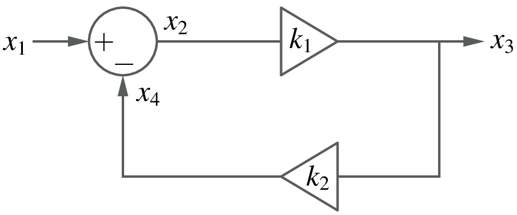
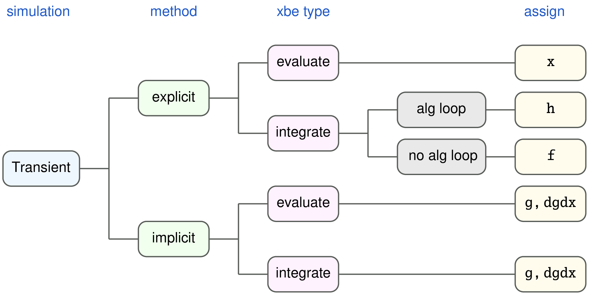
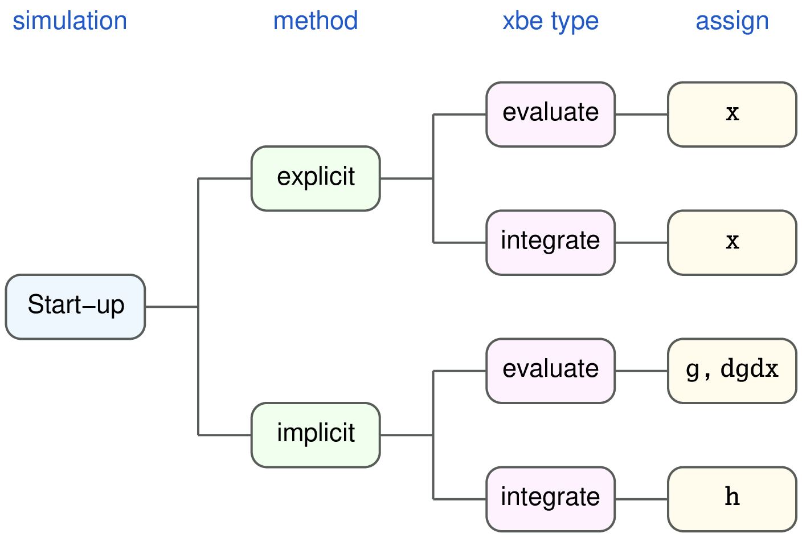

.. _functions:

=============================
``f``, ``g``, ``h`` functions
=============================

An attractive feature offered by GSEIM is the facility for
the user to make up a new element (``xbe``). In order to
use this facility effectively, it is important to understand
the working of explicit and implicit methods for solving ODEs
(see
`SEQUEL User's manual-Part 1 <https://www.ee.iitb.ac.in/~sequel/sequel_manual_1.pdf>`_,
Chapters 4 and 6, for a short review).

.. _trns:

Transient simulation
====================

Here, we will take two
representative methods, Forward Euler (FE) and Backward Euler (BE),
and explain what information about the ODEs needs to be provided
by the ``xbe`` template in each case. The FE method has its limitations
in terms of accuracy and stability and is therefore rarely used.
However, for the purpose of this discussion, it is adequate.
For simplicity, we consider a single ODE of the form,

.. math::
   :label: eq_ode_1

   \displaystyle\frac{dx_k}{dt} = u(x_1,\,x_2,\cdots,\,t).

The discretised forms of Eq. :eq:`eq_ode_1` obtained with the
FE and BE methods are given by

.. math::
   :label: eq_fe_1

   FE:~x_k^{n+1} = x_k^n + h\,u(x_1^n,\,x_2^n,\cdots,\,t_n),

.. math::
   :label: eq_be_1

   BE:~x_k^{n+1} = x_k^n + h\,u(x_1^{n+1},\,x_2^{n+1},\cdots,\,t_{n+1}),

where :math:`x_i^n` is the numerical solution at time :math:`t_n`.
There is a striking difference between these two forms: The right-hand side
involves
*known* quantities
:math:`(x_1^n,\,x_2^n,\cdots)`
in the FE formula, and
*unknown* quantities
:math:`(x_1^{n+1},\,x_2^{n+1},\cdots)`
in the BE formula.
This implies that, to obtain :math:`x_k^{n+1}`, we only need to
*evaluate* the right-hand side of :eq:`eq_fe_1` for the FE method,
but *solve* :eq:`eq_be_1` for the BE method.

Assuming that :math:`u(x_1,\,x_2,\cdots)` is in general a nonlinear
function, the
`Newton-Raphson method <https://www.ee.iitb.ac.in/~sequel/sequel_manual_1.pdf>`_
is used in GSEIM to solve :eq:`eq_be_1`, requiring the function value :math:`u`
as well as the derivative (Jacobian) values
:math:`\displaystyle\frac{\partial u}{\partial x_1}, \displaystyle\frac{\partial u}{\partial x_2}, \cdots`.
This brings us to the following requirement from an ``xbe`` template of
``integrate`` type.

**Transient simulation with explicit methods:** Supply
:math:`u(x_1,\,x_2,\cdots,\,t)`. The function :math:`u` in :eq:`eq_ode_1`
is denoted by ``f`` in GSEIM terminology.

**Transient simulation with implicit methods:** Supply
:math:`u(x_1,\,x_2,\cdots,\,t)` as well as 
:math:`\displaystyle\frac{\partial u}{\partial x_1}, \displaystyle\frac{\partial u}{\partial x_2}, \cdots`.
These are denoted by ``g``, ``dgdx`` in GSEIM terminology.

Note that, since there are multiple ODEs in general in an ``integrate`` type
``xbe`` template, ``f``, ``g`` are one-dimensional vectors, and ``dgdx`` is a
two-dimensional vector.

In ``xbe``'s of type ``evaluate``, the equations are of the form,

.. math::
   :label: eq_eval_1

   y = u(x_1,\,x_2,\cdots,\,t),

where
:math:`x_1`,
:math:`x_2`,
:math:`\cdots`
are the input variables, and
:math:`y`
is the output variable.
If an explicit method is being used, GSEIM expects
the ``xbe`` template to return
:math:`y`.
If an implicit method is being used, GSEIM expects
information about a function
:math:`v`, defined as

.. math::
   :label: eq_eval_2

   v \equiv y - u(x_1,\,x_2,\cdots,\,t).

In this case, the ``xbe`` template is expected to return
:math:`v` and its derivatives with respect to the variables
involved in that equation. The variables to be assigned in
the ``xbe`` template are the vectors ``g`` and ``dgdx``.

.. _startup:

Start-up simulation
===================

In some situations, it is required to assign specific values
to the state variables in the system (such as :math:`x_k` in
:eq:`eq_ode_1`), and solve for the remaining variables. We will
refer to this type of simulation as *start-up* simulation.

:eq:`eq_ode_1` in the start-up scenario is written as

.. math::
   :label: eq_strt_1

   x_k = x_k^{st},

where :math:`x_k = x_k^{st}` is the start-up value. If an explicit
method is being used, the ``xbe`` template simply needs to make the
above assignment. If an implicit method is being used, :eq:`eq_strt_1`
needs to be rewritten as

.. math::
   :label: eq_strt_2

   w \equiv x_k - x_k^{st} = 0,

and :math:`w` needs to be returned by the ``xbe`` template (in the form
of vector ``h``).

For ``evaluate`` type elements, the start-up situation can be handled in
the same manner as the transient situation.

Algebraic loops
===============

The *flow-graph* approach, with each element having input and output ports,
runs into problems if there are *algebraic loops* in the system. For example,
consider the following system.

In this system, there are no time derivatives. It is therefore sufficient to
consider any time :math:`t_n` and see if we can obtain
:math:`x_2^n`,
:math:`x_3^n`,
:math:`x_4^n`
in terms of the input
:math:`x_1^n`.
The following equations must be satisfied:

.. math::
   :label: eq_alg_1

   x_2^n = x_1^n - x_4^n,

.. math::
   :label: eq_alg_2

   x_4^n = k_2 x_3^n,

.. math::
   :label: eq_alg_3

   x_3^n = k_1 x_2^n.

In an explicit method, we treat :math:`x_1^n` as the
source, and then compute variables one by one, following
the arrows in the figure, by evaluating Eqs.
:eq:`eq_alg_1` to
:eq:`eq_alg_3`
in succession. This approach leads to a problem: The three
equations are supposed to be valid *simultaneously*. However, since
:eq:`eq_alg_3` is evaluated *after*
:eq:`eq_alg_2`, the value of
:math:`x_3^n` is not consistently computed.
This type of conflict occurs when there is an *algebraic loop*
in the system, i.e., there is a loop in which the variables are
related through purely {\it algebraic} equations, not involving
time derivatives.

If an implicit method is used for the above system, Eqs.
:eq:`eq_alg_1` to
:eq:`eq_alg_3`
are solved simultaneously (as an algebraic system of equations),
and there is no conflict.

Now consider applying an explicit method to a system which has
both ``integrate`` type elements (involving time derivatives)
and ``evaluate`` type elements. If there is an algebraic loop
in the system, a consistent solution can be obtained in two steps:

#. Update the outputs of ``integrate`` type elements.

#. Solve the algebraic system of equations involving the remaining
   variables using a suitable method (GSEIM uses the
   `Newton-Raphson method <https://www.ee.iitb.ac.in/~sequel/sequel_manual_1.pdf>`_.

The second step is implemented in GSEIM by holding the updated output
values of ``integrate`` type elements (denoted by :math:`x^u`)
constant, and solving the resulting algebraic set of equations.
In other words, for ``integrate`` time elements, we need to replace
the original equation

.. math::

   \displaystyle\frac{dx_k}{dt} = u(x_1,\,x_2,\cdots,\,t).

with

.. math::

   x_k - x_k^u = 0,

and the ``xbe`` template in this situation should return
:math:`h \equiv x_k - x_k^u`.

Summary
=======

The above discussion is summarised  in the following figures.

|

