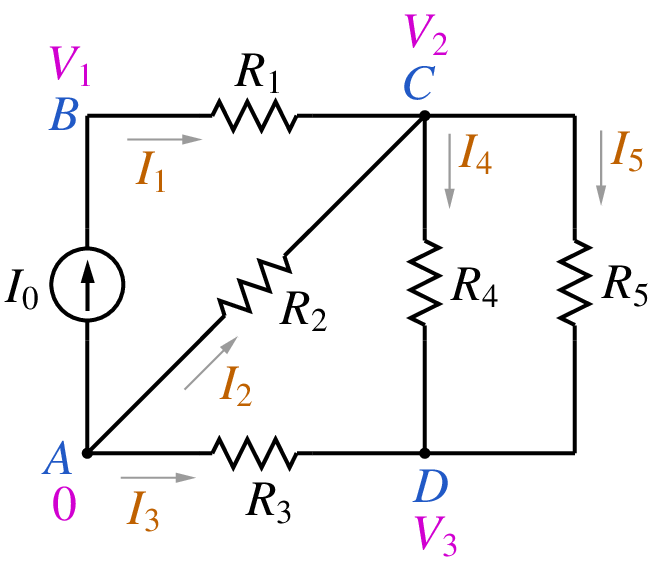
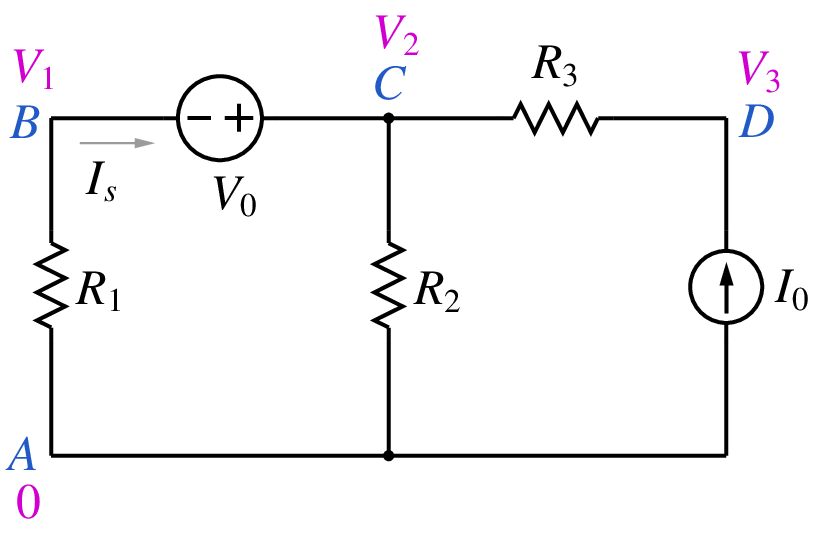

.. _mna:

#######################
Modified nodal analysis
#######################

In this section, we will look at the Modified Nodal Analysis (MNA)
approach which is used by GSEIM for assemling equations arising
from electrical circuits.
To find the solution for an electrical circuit, the following constraints
need to be satisfied simultaneously:

- Kirchoff's current law (KCL) at each node,
- Kirchoff's voltage law (KVL) for each loop,
- equation(s) describing the behaviour of each element involved
  in the circuit (e.g., resistor, capacitor, diode, transistor, switch,
  transformer).

The most common approach employed to solve this set of equations
is Modified Nodal Analysis. As the name suggests, MNA is a
modified version of Nodal Analysis (NA) which is based on KCL equations
written in terms of node voltages. In the following, we will describe
the NA approach with the help of an example, see why it needs to be
modified, and then look at the MNA approach. For now, we will restrict
our discussion to linear circuits operating under DC conditions.
In later sections, we will see how the MNA approach can be used for circuits
involving nonlinear components and time derivatives.

.. _nodal:

==============
Nodal analysis
==============

In nodal analysis, one of the circuit nodes is taken as the reference node
(ground) and is assigned a node voltage of :math:`0\,{\textrm{V}}`. All
other node voltages are defined with respect to the reference node.
The element currents are written in terms of the node voltages, and the
sum of the element currents at each node is equated to zero, as required
by KCL. The resulting set of equations is then solved for the
unknowns -- the node voltages. Other quantities of interest such as
currents, branch voltages are computed by post-processing the solution
vector, i.e., the node voltages. Let us illustrate this process with an
example.

Consider the circuit shown below.

..
   .. _circuit1:

   .. figure:: mna1.png
      :width: 230
      :alt: nodal analysis example

      Circuit 1

We take one of the nodes (node A) as the
reference node. The other nodes (B, C, D) are assigned node voltages
:math:`V_1`,
:math:`V_2`,
:math:`V_3`. We write the various element currents in terms of the node
voltages, e.g.,
:math:`I_1 = G_1(V_1-V_2)`,
:math:`I_3 = G_3(0-V_3)`, where
:math:`G_1 = 1/R_1`, etc. Finally, we substitute the expressions for
the currents in the KCL equations at nodes B, C, D, and get the following
set of equations.

.. math::
   :label: eq_mna_1

   \begin{align}
    {\textrm{KCL at B}}:~~ &
    -I_0 + I_1 = 0
    \,, \\
    {\textrm{KCL at C}}:~~ &
    -I_1 - I_2 + I_4 + I_5 = 0
    \,, \\
    {\textrm{KCL at D}}:~~ &
    -I_3 - I_4 - I_5 = 0
    \,.
   \end{align}

In terms of node voltages, we have

.. math::
   :label: eq_mna_2

   \begin{align}
    -I_0 + G_1(V_1-V_2) & = & 0\,,\\
    - G_1(V_1-V_2) +G_2 V_2 + (G_4+G_5)(V_2-V_3)& = & 0\,,\\
    G_3V_3 - (G_4+G_5)(V_2-V_3)& = & 0\,.
   \end{align}

The above equations can be written in a matrix form:

.. math::
   :label: eq_mna_3

   \left[
   \begin{array}{ccc}
    G_1 ~&
    -G_1 ~&
    0
   \\
    -G_1 ~&
    G_1+G_2+G_4+G_5 ~&
    -G_4-G_5
   \\
    0 &
    -G_4-G_5 &
    G_3+G_4+G_5
   \end{array}
   \right]
   \left[
   \begin{array}{c}
    V_1 \\
    V_2 \\
    V_3
   \end{array}
   \right]
   \thinspace
   =
   \left[
   \begin{array}{c}
   I_0 \\
   0 \\
   0
   \end{array}
   \right]
   \,.

We now have a matrix description of the circuit equations:
:math:`{\bf{Y}}{\bf{V}} = {\bf{I}}_S`. The matrix :math:`{\bf{Y}}`
is called the admittance matrix, :math:`{\bf{V}}` is the vector
of node voltages which we want to obtain, and :math:`{\bf{I}}_S`
is the current source vector, which contains :math:`\pm I_k`,
:math:`I_k` being the current of an independent current source
connected at node :math:`k`. For larger circuits, the admittance
matrix is typically sparse, with only 10 to 15\% non-zero entries.
The sparse nature of the admittance matrix can be exploited to
reduce the storage requirement and the number of arithmetic
operations (and therefore the CPU time) in solving the linear system.

.. _modifiednodal:

===
MNA
===

If there are voltage sources in the circuit, the NA approach needs
to be modified. As an example, consider the following circuit.

..
   .. _circuit2:

   .. figure:: mna2.png
      :width: 300
      :alt: MNA example

      Circuit 2

We take A as the reference node and assign
:math:`V_1`,
:math:`V_2`,
:math:`V_3` to the remaining nodes. When we attempt to write KCL at node
B or C, we encounter a problem -- the current through the voltage
source cannot be written in terms of the node voltages :math:`V_1`
and :math:`V_2`, and the nodal analysis approach therefore needs to
be modified. In the MNA approach, we augment the solution vector
with currents through voltage sources, and the KCL equations are
written in terms of the node voltages as well as these additional
variables, i.e., currents through voltage sources (including dependent
voltage sources CCVS, VCVS).

Using the MNA approach for the above circuit, we get

.. math::
   :label: eq_mna_4

   \begin{align}
    {\textrm{KCL at B}}:~~ &
    G_1V_1 + I_s &\hspace{-2mm}= 0
    \,, \\
    {\textrm{KCL at C}}:~~ &
    -I_s + G_2V_2 +G_3(V_2-V_3) &\hspace{-2mm}= 0
    \,, \\
    {\textrm{KCL at D}}:~~ &
    -I_0 + G_3(V_3-V_2) &\hspace{-2mm}= 0
    \,.
   \end{align}

We now have four unknowns (:math:`V_1`, :math:`V_2`, :math:`V_3`,
:math:`I_s`) but only three equations. The fourth equations comes
from the element equation for the voltage source, viz.,
:math:`V_2 - V_1 = V_0`. The equations can be written in a matrix form:

.. math::
   :label: eq_mna_5

    \left[
    \begin{array}{cccc}
     G_1 ~&
     0 ~&
     0 ~&
     1
    \\
     0 ~&
     G_2+G_3 ~&
     -G_3 ~&
     -1
    \\
     0 &
     -G_3 &
     G_3 ~&
     0
    \\
     -1 &
     1 &
     0 ~&
     0
    \end{array}
    \right]
    \left[
    \begin{array}{c}
     V_1 \\
     V_2 \\
     V_3 \\
     I_s
    \end{array}
    \right]
    \thinspace
    =
    \left[
    \begin{array}{c}
    0 \\
    0 \\
    I_0 \\
    V_0
    \end{array}
    \right]
    \,.

We can already guess what a circuit simulator
must be doing behind the scenes for a linear circuit under DC conditions:

- Read the "netlist" (see :ref:`gseimorg`), which is a description of the connections
  in the circuit (the *topology*) and the specification of each element (the *behaviour*).
- Decide "what goes where" in the matrix equation: This step is called "parsing"
  where we need to figure out the following.

  - How many variables (unknowns)?
  - What does each row of the matrix correspond to? A KCL
    or the branch equation for one of the voltage sources?
  - Where are the non-zero entries in the MNA matrix? How is each
    entry computed in terms of the circuit parameters?

- Solve the matrix equation: This is the most crucial part of a circuit simulator
  since it generally takes the largest chunk of the CPU time, particularly for
  large circuits. The reason is easy to understand: The number of multiplications
  involved in solving :math:`{\bf{A}}{\bf{x}} = {\bf{b}}`, where :math:`{\bf{A}}` is an
  :math:`N\times N` matrix, goes as :math:`N^3`. By exploiting sparsity, the number of
  multiplications can be reduced, but the dependence on :math:`N` remains superlinear.
- Calculate the quantities of interest by post-processing. Solving the MNA circuit
  equations yields the node voltages and voltage source currents. These can be used
  to obtain other quantities simply by post-processing, i.e., without solving any
  additional equations.

Note that we have described the MNA approach for linear circuits in
a DC situation only. It needs to be extended to nonlinear circuits and also
to elements involving time derivatives (e.g., capacitors and
inductors). We will consider that in later sections.

