.. _nr:

#####################
Newton-Raphson method
#####################

Nonlinear equations arise in a wide variety of electronic and
power electronic circuits, and they need to be solved using an
iterative method. The Newton-Raphson (NR) iterative method
is commonly used for solving nonlinear equations because of
its excellent convergence properties. GSEIM also employs the
NR method, and it would be useful for GSEIM users to be
familiar with the functioning of the NR method.

To begin with, let us see where the NR method comes from.

.. _nr_single_eq:

===============
Single equation
===============

Consider the equation
:math:`f(x) = 0`. Let :math:`x = r` be the root (assumed to be single and real),
i.e., :math:`f(r) = 0`. Let us say that we have some idea of the root in
the form of an *initial guess* :math:`x^{(0)}`. The goal of the NR
method is to iteratively refine this value so that :math:`f(x) = 0`
is satisfied to a higher accuracy with every NR iteration. We denote
the successive values of :math:`x` by
:math:`x^{(0)}`,
:math:`x^{(1)}`,
:math:`x^{(2)}`,
:math:`\cdots`

Consider :math:`x = x^{(i)}`. Expanding :math:`f(x)` around this value, we get

.. math::
   :label: eq_nr_1

   f(x^{(i)} + \Delta x^{(i)}) =
   f(x^{(i)})
   + \Delta x^{(i)}\,\left.\displaystyle\frac{df}{dx}\right|_{x^{(i)}}
   + \displaystyle\frac{(\Delta x^{(i)})^2}{2!}\,\left.\displaystyle\frac{d^2f}{dx^2}\right|_{x^{(i)}}
   + \cdots

We seek the value of :math:`\Delta x^{(i)}` which will satisfy
:math:`f(x^{(i)} + \Delta x^{(i)}) = 0`, assuming that the
contribution from second- and higher-order terms is small
compared to the first term, i.e.,

.. math::
   :label: eq_nr_2

   f(x^{(i)} + \Delta x^{(i)}) \approx
   f(x^{(i)})
   + \Delta x^{(i)}\,\left.\displaystyle\frac{df}{dx}\right|_{x^{(i)}}
   = 0,~{\textrm{or}}~~
   \Delta x^{(i)} = -\,\displaystyle\frac{f(x^{(i)})}{\left.\displaystyle\frac{df}{dx}\right|_{x^{(i)}}}\,.

If our assumption (that only the first term in :math:`\Delta x^{(i)}` is significant)
is indeed valid, our job is done: we simply add
:math:`\Delta x^{(i)}` to
:math:`x^{(i)}`, and that gives us the solution. If not, we treat
:math:`x^{(i)}+\Delta x^{(i)}` as the next candidate for :math:`x`
(i.e., :math:`x^{(i+1)} = x^{(i)}+\Delta x^{(i)}`), perform
another NR iteration, and so on. Let us illustrate this
procedure with an example.

Consider :math:`f(x)` given by

.. math::
   :label: eq_nr_3

   f(x) =
   a_3 x^3 +
   a_2 x^2 +
   a_1 x +
   a_0,

with
:math:`a_3\hspace{-1mm}=\hspace{-1mm}1`,
:math:`a_2\hspace{-1mm}=\hspace{-1mm}-3.2`,
:math:`a_1\hspace{-1mm}=\hspace{-1mm}8.7`,
:math:`a_0\hspace{-1mm}=\hspace{-1mm}-14.3`.

The equation :math:`f(x) = 0` has a real root at :math:`x = 2.2` as seen
in the following figure.

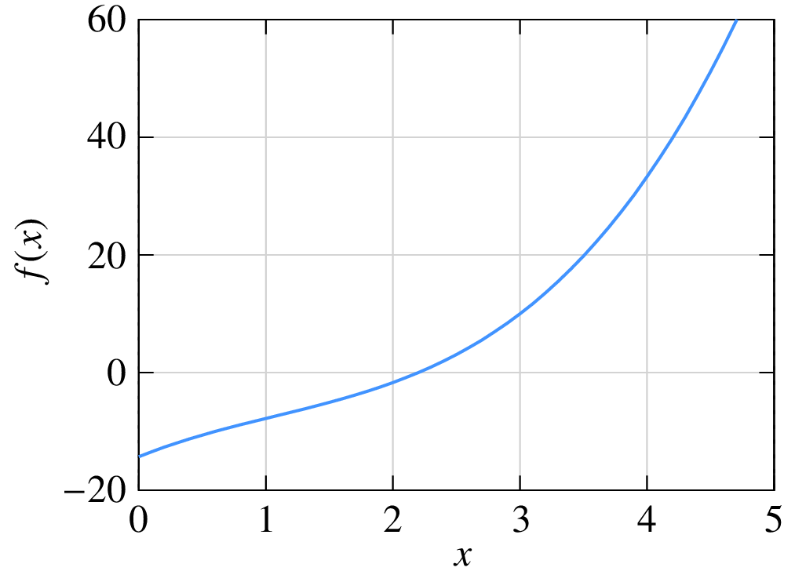

The following C++ program performs NR iterations to obtain the root.

.. code-block:: text
   :linenos:

   #include <iostream>
   #include <iomanip>
   #include <math.h>
   using namespace std;

   int main ()
   {
      double x,f,dfdx,delx,tolr,r;
      double a3,a2,a1,a0;
      double x2,x3;

      a3 = 1.0; a2 = -3.2; a1 = 8.7; a0 = -14.3;

      x = 4.0;        // initial guess
      tolr = 1.0e-8;  // tolerance
      r = 2.2;        // actual solution

      for (int i=0; i < 10; i++) {
        x2 = x*x; x3 = x2*x;              // powers of x
        f = a3*x3 + a2*x2 + a1*x + a0;    // function
        dfdx = 3.0*a3*x2 + 2.0*a2*x + a1; // derivative
        delx = -f/dfdx;                   // correction delta_x

        cout << std::setw(2) << i << "  ";
        cout << std::scientific;
        cout << x << "  " << f << "  " << delx << "  " << (x-r) << endl;

        if (fabs(f) < tolr) break;        // tolerance met; exit loop
        x = x + delx;                     // update x
      }
      return 0;
   }

The output of the program is shown below.

+-----------+-------------------------------+--------------------------------+----------------------------------+---------------------------------+
| :math:`i` | :math:`x^{(i)}`               |  :math:`f(x^{(i)})`            | :math:`\Delta x^{(i)}`           | :math:`(x^{(i)}-r)`             |
+===========+===============================+================================+==================================+=================================+
| 0         | :math:`4.000000\times 10^{0}` | :math:`3.330000\times 10^{1}`  | :math:`-1.070740\times 10^{0}`   | :math:`1.800000\times 10^{0}`   |
+-----------+-------------------------------+--------------------------------+----------------------------------+---------------------------------+
| 1         | :math:`2.929260\times 10^{0}` | :math:`8.861467\times 10^{0}`  | :math:`-5.646248\times 10^{-1}`  | :math:`7.292605\times 10^{-1}`  |
+-----------+-------------------------------+--------------------------------+----------------------------------+---------------------------------+
| 2         | :math:`2.364636\times 10^{0}` | :math:`1.601388\times 10^{0}`  | :math:`-1.548606\times 10^{-1}`  | :math:`1.646356\times 10^{-1}`  |
+-----------+-------------------------------+--------------------------------+----------------------------------+---------------------------------+
| 3         | :math:`2.209775\times 10^{0}` | :math:`8.966910\times 10^{-2}` | :math:`-9.739489\times 10^{-3}`  | :math:`9.774978\times 10^{-3}`  |
+-----------+-------------------------------+--------------------------------+----------------------------------+---------------------------------+
| 4         | :math:`2.200035\times 10^{0}` | :math:`3.243738\times 10^{-4}` | :math:`-3.548854\times 10^{-5}`  | :math:`3.548901\times 10^{-5}`  |
+-----------+-------------------------------+--------------------------------+----------------------------------+---------------------------------+
| 5         | :math:`2.200000\times 10^{0}` | :math:`4.282173\times 10^{-9}` | :math:`-4.685091\times 10^{-10}` | :math:`4.685092\times 10^{-10}` |
+-----------+-------------------------------+--------------------------------+----------------------------------+---------------------------------+

Note how quickly the NR process converges to the root. After three
iterations, we already have an accuracy of 0.44\%. This rapid
convergence is the reason for the popularity of the NR method.
Near convergence, the "errors" for iterations :math:`i` and
:math:`(i+1)` are related by

.. math::
   :label: eq_nr_4

   \epsilon ^{(i+1)} = k\left[\epsilon^{(i)}\right]^2\,,

where
:math:`\epsilon^{(i)} = \left|x^{(i)}-r\right|` is the deviation of
:math:`x^{(i)}` from the root :math:`r`. The factor
:math:`k \approx g''(r)/2`, i.e.,
:math:`\displaystyle\frac{1}{2}\left.\displaystyle\frac{d^2f}{dx^2}\right|_{x=r}`.
Eq. :eq:`eq_nr_4` explains why the error goes down so dramatically as the NR
process converges. Because of the second power in Eq. :eq:`eq_nr_4`, the NR
process is said to have *quadratic convergence*.

.. _nr_set_of_equations:

=============================
Extension to set of equations
=============================

The NR method can be generalised to a system of :math:`N` equations in :math:`N` variables
given by

.. math::
   :label: eq_nr_5

   \begin{align}
    f_1 (x_1,x_2,~.~.~,x_N)&=0,\\
    f_2 (x_1,x_2,~.~.~,x_N)&=0,\\
    ~~~~~~~~~~~~~ \vdots & \\
    f_N (x_1,x_2,~.~.~,x_N)&=0.
   \end{align}

In this case, we define a solution *vector*,

.. math::
   :label: eq_nr_6

   {\bf x^{(i)}}=
    \left[
    \begin{array}{c}
      x_1^{(i)}\cr x_2^{(i)}\cr ..\cr ~~\cr x_N^{(i)}\cr
    \end{array}
    \right]~.

We start with an initial guess for the solution
vector, i.e.,
:math:`x_1^{(0)}`,
:math:`x_2^{(0)}`,
:math:`\cdots`,
:math:`x_N^{(0)}`.
Note that, in practice, it is often difficult to come up with a
good initial guess, and in the absence of a better alternative,
:math:`x_1^{(i)} = 0`,
:math:`x_2^{(i)} = 0`, :math:`\cdots`
may be used.
The correction vector in the :math:`i^{\mathrm{th}}` iteration,
:math:`\Delta {\bf{x}}^{(i)}` is computed as

.. math::
   :label: eq_nr_8

   \Delta x^{(i)} = -\left[{\bf{J}}^{(i)}\right]^{-1}{\bf{f}}^{(i)},

where

.. math::
   :label: eq_nr_9

   {\bf f}^{(i)}=
    \left[
    \begin{array}{c}
       f_1({\bf x}^{(i)})\cr f_2({\bf x}^{(i)})\cr ..\cr
       f_N({\bf x}^{(i)})\cr
    \end{array}
    \right],~~~
       {\bf J}^{(i)}=
       \left[
       \begin{array}{cccc}
       \displaystyle\frac{\partial f_1}{\partial x_1}&
       \displaystyle\frac{\partial f_1}{\partial x_2}&
       .~.&
       \displaystyle\frac{\partial f_1}{\partial x_N}
       \\[0.15in]
       \displaystyle\frac{\partial f_2}{\partial x_1}&
       \displaystyle\frac{\partial f_2}{\partial x_2}&
       .~.&
       \displaystyle\frac{\partial f_2}{\partial x_N}
       \\
       .~.&
       .~.&
       .~.&
       \\[0.15in]
       \displaystyle\frac{\partial f_N}{\partial x_1}&
       \displaystyle\frac{\partial f_N}{\partial x_2}&
       .~.&
       \displaystyle\frac{\partial f_N}{\partial x_N}
       \end{array}
       \right],

and the functions and derivatives are evaluated at the current values,
:math:`x_1^{(i)}`,
:math:`x_2^{(i)}`,
:math:`\cdots`,
:math:`x_N^{(i)}`. The NR procedure is otherwise similar to that for the
one variable case, as seen in the flow-chart below.

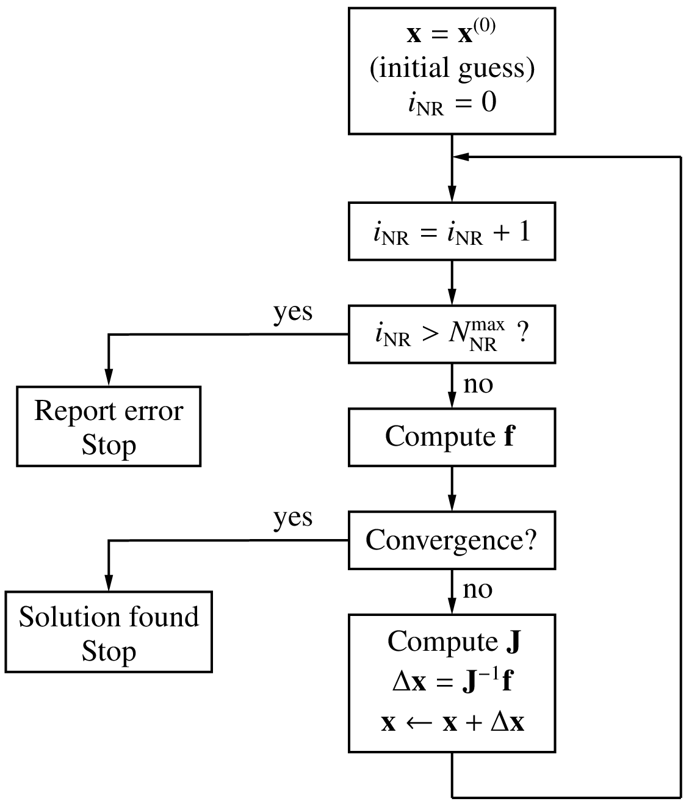

.. _nr_convergence_criteria:

====================
Convergence criteria
====================

In the NR method, we need to set a "convergence criterion" to determine
when to stop the NR iterations. In the program given in the
:ref:`single equation <nr_single_eq>` section, for example, the variable
``tolr`` (tolerance) served this purpose.
The following convergence criteria are commonly used.

- Norm of :math:`{\bf{f}}`: In this case, we check if the function values
  are small. Typically, the 2-norm, defined as

  :math:`||\,{\bf{f}}\,||_2 = \left[\displaystyle\sum_{i=1}^{N}f_i^2\right]^{1/2}`,

  is computed, and the NR iterations are said to converge if
  :math:`||{\bf{f}}||_2 < \epsilon`, a suitable tolerance value.
  This is an *absolute* convergence criterion since our
  goal is precisely to solve the set of equations to get
  :math:`f_i = 0` (for each :math:`i`) which means in practice that
  :math:`|f_i|` (or somewhat equivalently, the 2-norm) should be made
  as small as possible.

  .. _delx_norm:

- :math:`\Delta{\bf{x}}` norm: Here, we check if each component of
  the correction vector is sufficiently small *relative* to its current
  value, i.e.,
  :math:`|\Delta x_i| < \epsilon  \,|x_i|`.
  This is a *relative* criterion and is based on the fact that, as
  the NR process converges, :math:`\Delta x_i` become
  smaller, as we have seen in the :ref:`one-variable example <nr_single_eq>`.

  .. _spice_norm:

- SPICE convergence criterion: In SPICE, a tolerance is computed for
  each variable as follows:

  .. math::
     :label: eq_nr_spice_1

     \tau _i = k_{\mathrm{rel}}\times
     {\textrm{max}}
     \left(
      |x_i^{(k)}|,
      |x_i^{(k+1)}|
     \right)
     + \tau _{\mathrm{abs}},

  where
  :math:`k_{\mathrm{rel}}` (typically 0.001) and
  :math:`\tau _{\mathrm{abs}}` are constants, and 
  :math:`x_i^{(k)}` denotes the value of :math:`x_i` in the
  :math:`k^{\mathrm{th}}` iteration.
  The first term specifies a *relative* tolerance
  while the second term is an *absolute* tolerance.
  If :math:`x` is of type voltage, :math:`\tau _{\mathrm{abs}}` may be
  :math:`0.01\,{\textrm{mV}}`, for
  example. Convergence is said to be attained if

  .. math::
     :label: eq_nr_spice_2

     |x_i^{(k+1)}-x_i^{(k)}| < \tau _i.
     \label{eq_nr_spice_2}

  SPICE uses the term ``RELTOL`` for :math:`k_{\mathrm{rel}}`,
  ``VNTOL`` for :math:`\tau _{\mathrm{abs}}` for node voltage variables, and
  ``ABSTOL`` for :math:`\tau _{\mathrm{abs}}` for currents.
  In a variety of electronic circuits,
  the tried and tested SPICE convergence criterion is found to work well.

Why are there so many different convergence criteria?
Isn't there a simple "universal" convergence criterion which
we can use for all problems? To answer this question, let us
take a closer look at convergence of the NR process.

As we have seen earlier, the "error," i.e., the difference
between the numerical solution and the actual solution, goes down
dramatically with each iteration, as the NR process converges.
If our computer had infinite precision, the error can be reduced
to arbitrarily small values by performing additional NR iterations.
In practice, computers have a finite precision.
With single-precision (32-bit) numbers, the smallest number that can
be represented is about :math:`10^{-38}`, and the largest number is
about :math:`10^{+38}`.
With double-precision (64-bit) numbers, the smallest and largest numbers
are about :math:`10^{-308}` and :math:`10^{+308}`, respectively.
Furthermore, because of the finite number of bits used for the mantissa,
only a finite number of real numbers can be represented, say,
:math:`r_1`,
:math:`r_2`,
:math:`r_3`,
:math:`\cdots`
Any number falling between :math:`r_k` and :math:`r_{k+1}` is rounded off to
:math:`r_k` or :math:`r_{k+1}`, leading to a
"round-off error"
which is of the order of
:math:`10^{-7}` for single-precision numbers and
:math:`10^{-16}` for double-precision numbers.

The round-off error, however small, is finite, and it limits the
accuracy that we can achieve with the NR method.
If our convergence check is too stringent,
convergence will not be attained, and
the NR process will get terminated with
an error message (although the solution may already be sufficiently
accurate). If it is too loose, we end up with the wrong solution.
Setting an appropriate convergence criterion is therefore crucial
in implementing the NR method, as illustrated in the following example.

Consider the systems of equations,

.. math::
   :label: eq_nr_10a

   \begin{align}
    f_1 (x_1,x_2)&\equiv k\, (x_1+x_2-6\sqrt{3}) &= 0,\\
    f_2 (x_1,x_2)&\equiv 10x_1^2 -x_2^2+45 &= 0.
   \end{align}

Clearly, the solution would not depend on :math:`k` since
it is simply a scaling factor.
We want to solve this system of equations with the initial guess
:math:`x_1 = 1`,
:math:`x_2 = 1`.
With this initial guess, the NR method converges
to the solution
:math:`x_1 = \sqrt{3}`,
:math:`x_2 = 5\sqrt{3}`.
(Note that the above system of equations actually has another
solution; but only the solution
:math:`x_1 = \sqrt{3}`,
:math:`x_2 = 5\sqrt{3}`
is relevant for our discussion, considering the initial guess we have used.)

The :math:`||{\bf{f}}||_2` norm at each NR iteration obtained using
single-precision ``(float)`` numbers is shown in the following table.

+---+-------------------------------------+
|   |     :math:`||{\bf{f}}||_2`          |
|   +------------------+------------------+
| i | :math:`k = 1`    | :math:`k = 10^5` |
+===+==================+==================+
| 0 | ``5.464824e+01`` | ``8.392304e+05`` |
+---+------------------+------------------+
| 1 | ``7.306992e+01`` | ``7.306991e+01`` |
+---+------------------+------------------+
| 2 | ``6.915764e+02`` | ``6.915771e+02`` |
+---+------------------+------------------+
| 3 | ``1.559785e+02`` | ``1.559788e+02`` |
+---+------------------+------------------+
| 4 | ``2.633286e+01`` | ``2.633291e+01`` |
+---+------------------+------------------+
| 5 | ``1.710737e+00`` | ``1.710923e+00`` |
+---+------------------+------------------+
| 6 | ``9.535313e-03`` | ``2.567794e-02`` |
+---+------------------+------------------+
| 7 | ``7.662848e-06`` | ``7.152557e-02`` |
+---+------------------+------------------+
| 8 | ``2.870940e-06`` | ``2.384186e-02`` |
+---+------------------+------------------+
| 9 | ``2.870940e-06`` | ``2.384186e-02`` |
+---+------------------+------------------+

We can see that
:math:`||{\bf{f}}||_2`
reduces as the NR process converges to the solution, but after some point
(iteration 8), it does not reduce any further.
With :math:`k = 1` in Eq. :eq:`eq_nr_10a`,  the smallest value attained by
:math:`||{\bf{f}}||_2` is :math:`2.87\times 10^{-6}`, whereas with
:math:`k = 10^5`,
it is :math:`2.38\times 10^{-2}`, which is four orders larger.

Does it mean that the solution we obtain with
:math:`k = 10^5` is less accurate? In the following table, let us look at how
:math:`x_1` and :math:`x_2` evolve.

+---+--------------------------------------+--------------------------------------+
|   |            :math:`k = 1`             |        :math:`k = 10^5`              |
|   +-------------------+------------------+-------------------+------------------+
| i |   :math:`x_1`     |    :math:`x_2`   |   :math:`x_1`     |   :math:`x_2`    |
+---+-------------------+------------------+-------------------+------------------+
| 0 |  ``1.000000e+00`` | ``1.000000e+00`` |  ``1.000000e+00`` | ``1.000000e+00`` |
+---+-------------------+------------------+-------------------+------------------+
| 1 | ``-6.916087e-01`` | ``1.108391e+01`` | ``-6.916087e-01`` | ``1.108391e+01`` |
+---+-------------------+------------------+-------------------+------------------+
| 2 |  ``8.074338e+00`` | ``2.317966e+00`` |  ``8.074343e+00`` | ``2.317963e+00`` |
+---+-------------------+------------------+-------------------+------------------+
| 3 |  ``3.911292e+00`` | ``6.481012e+00`` |  ``3.911294e+00`` | ``6.481010e+00`` |
+---+-------------------+------------------+-------------------+------------------+
| 4 |  ``2.200773e+00`` | ``8.191531e+00`` |  ``2.200774e+00`` | ``8.191530e+00`` |
+---+-------------------+------------------+-------------------+------------------+
| 5 |  ``1.764788e+00`` | ``8.627517e+00`` |  ``1.764789e+00`` | ``8.627516e+00`` |
+---+-------------------+------------------+-------------------+------------------+
| 6 |  ``1.732234e+00`` | ``8.660070e+00`` |  ``1.732234e+00`` | ``8.660070e+00`` |
+---+-------------------+------------------+-------------------+------------------+
| 7 |  ``1.732051e+00`` | ``8.660254e+00`` |  ``1.732051e+00`` | ``8.660254e+00`` |
+---+-------------------+------------------+-------------------+------------------+
| 8 |  ``1.732051e+00`` | ``8.660254e+00`` |  ``1.732051e+00`` | ``8.660254e+00`` |
+---+-------------------+------------------+-------------------+------------------+
| 9 |  ``1.732051e+00`` | ``8.660254e+00`` |  ``1.732051e+00`` | ``8.660254e+00`` |
+---+-------------------+------------------+-------------------+------------------+

We see that, after iteration 6, there is no difference between
:math:`k = 1` and
:math:`k = 10^5`, and in fact these
values coincide with the expected solution
(:math:`x_1 = \sqrt{3}`,
:math:`x_2 = 5\sqrt{3}`) up to six decimal places. In practice, we
would be fine with this level of accuracy.

Clearly, if the 2-norm is used as the convergence criterion, it needs to be
carefully assigned. In the above example,
a 2-norm of :math:`10^{-3}` will work (i.e., the NR process
will exit after attaining convergence) for
:math:`k = 1`, but not with
:math:`k = 10^5`. This means that selection of the convergence
criterion must be made differently for different problems!
In reality, the situation is not so hopeless. For example, if
we are only interested in power electronic circuits, the default values
provided by GSEIM for the SPICE convergence criteria
would generally work well and may need to be tweaked only for
a few specific simulations.

.. _nr_graphical:

==========================================
Graphical interpretation of the NR process
==========================================

In the one-variable case, the NR process has a useful graphical
interpretation. The correction
:math:`\Delta x^{(i)}`
in the :math:`i^{\mathrm{th}}` NR iteration is given by

.. math::
   :label: eq_nr_11

   \Delta x^{(i)} = -\,\displaystyle\frac{f(x^{(i)})}{\left.\displaystyle\frac{df}{dx}\right|_{x^{(i)}}}\,.

Since :math:`\left.\displaystyle\frac{df}{dx}\right|_{x^{(i)}}`
is the slope of the :math:`f(x)` curve at
:math:`x = x^{(i)}`, the magnitude of
:math:`\Delta x^{(i)}` is given by drawing a tangent at the point
:math:`(x^{(i)},f(x^{(i)}))` and extending it to the :math:`x`-axis, as shown
below.

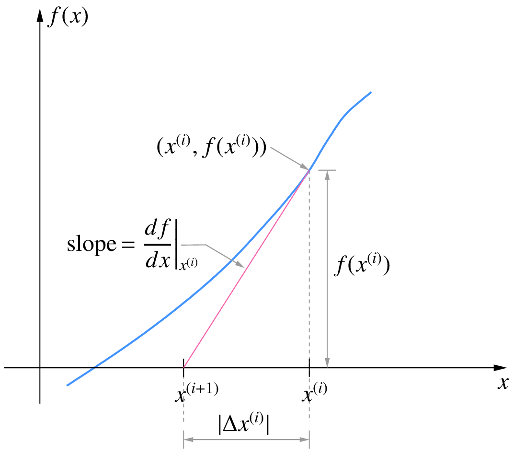

:math:`x^{(i+1)} = x^{(i)} + \Delta x^{(i)}` is then obtained by
simply going from
:math:`x^{(i)}`
in the negative :math:`x`-direction if the sign of
:math:`\left.\displaystyle\frac{df}{dx}\right|_{x^{(i)}}`
is positive (and *vice versa*) a distance of
:math:`\Delta x^{(i)}`. This leads to the following interpretation
of the NR process.

- Draw a tangent at :math:`(x^{(i)},f(x^{(i)}))`.
- Extend the tangent to the :math:`x`-axis.
- The point of intersection of the tangent with the :math:`x`-axis
  gives the next values of :math:`x`, i.e., :math:`x^{(i+1)}`.

The NR process for Eq. :eq:`eq_nr_3` is shown in the following figure.
It is easy to see that, if :math:`f(x)` is linear
(i.e., :math:`f(x) = k_1x+ k_2`),
the NR process will converge in exactly one iteration.

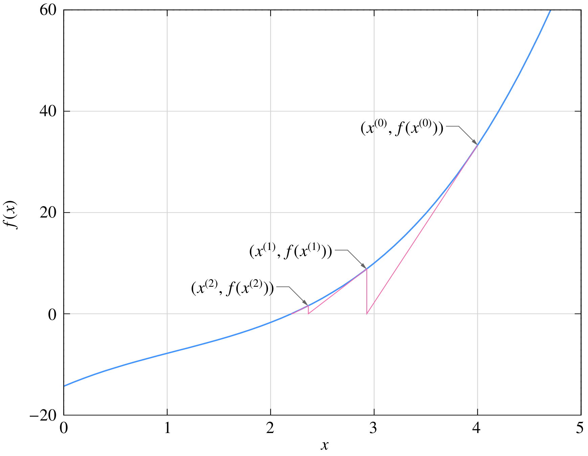

.. _nr_convergence_issues:

==================
Convergence issues
==================

We have seen that the NR method has the desirable property of
rapid convergence. The big question is whether it will always
converge. The answer, unfortunately, is **no**. Convergence of the
NR method is guaranteed only if the initial guess is "sufficiently"
close to the solution (root). In the one-variable case, it can be
shown that, if

.. math::
   :label: eq_nr_12

   \displaystyle\frac{\left|f(x)f''(x)\right|}{(f'(x))^2} < 1

for some interval :math:`(x_1,x_2)` containing the root :math:`r`,
the NR method will converge for an initial guess
:math:`x^{(0)}` lying in that interval. If not, the NR process may
not converge.

As an example, consider

.. math::
   :label: eq_nr_13

   f(x) = \tan ^{-1}(x-a).

For this function,

.. math::
   :label: eq_nr_14

   f_1(x) \equiv
   \displaystyle\frac{f(x)f''(x)}{(f'(x))^2}
   = -2(x-a)\tan ^{-1}(x-a).

The plots of (a) :math:`f(x)` and (b) :math:`f_1(x)`
for :math:`a = 1.5` are shown below.

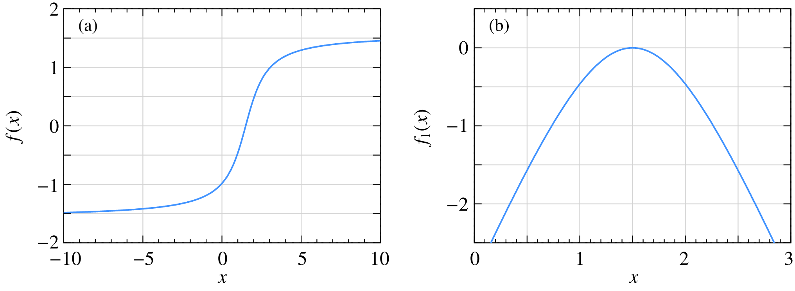

For :math:`|f_1(x)| < 1`, we need
:math:`0.735 < x < 2.265`. If the initial guess is within this range,
the NR process for :math:`f(x)` is guaranteed to converge
as seen in this example:

.. image:: nr8a.png
   :width: 600
   :alt: convergence issues 2

If the initial guess is outside the range
:math:`0.735 < x < 2.265`, the NR process is not guaranteed to
converge. For example, in the figure below, we can clearly see
that the NR process is *diverging*, i.e., the solution is moving
away from the root with every iteration.

.. _nr_atan_3:

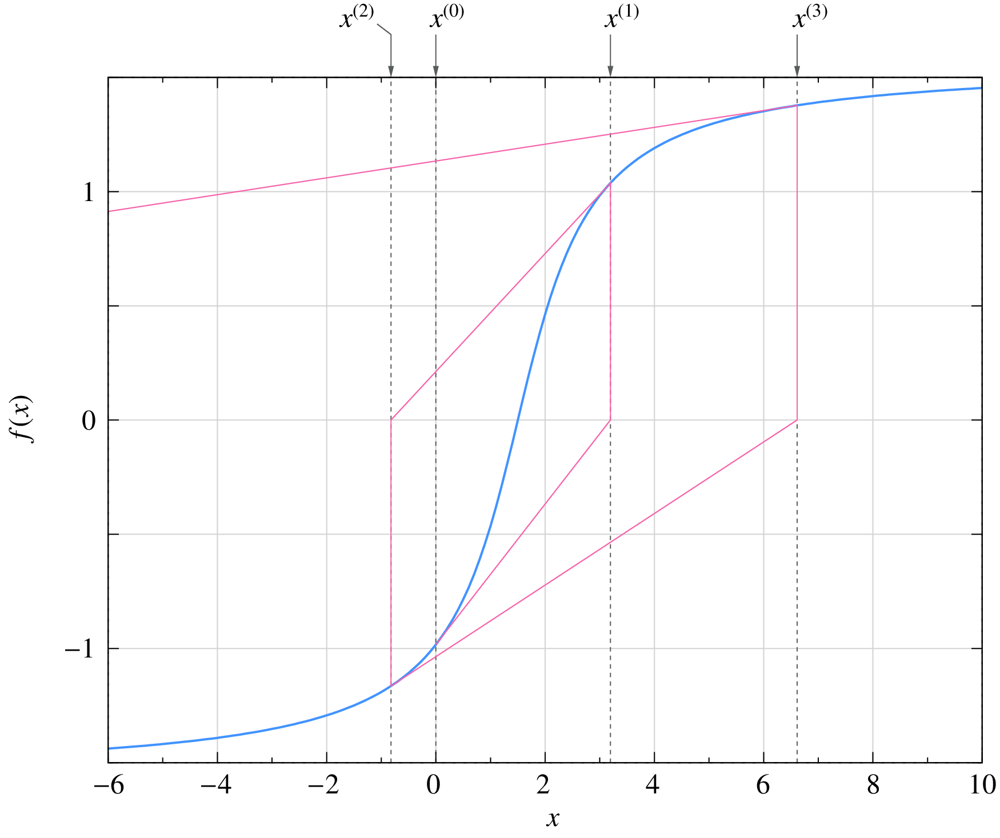

   Divergence example

An equally catastrophic situation, in which the NR process oscillates
around the root, is shown below.

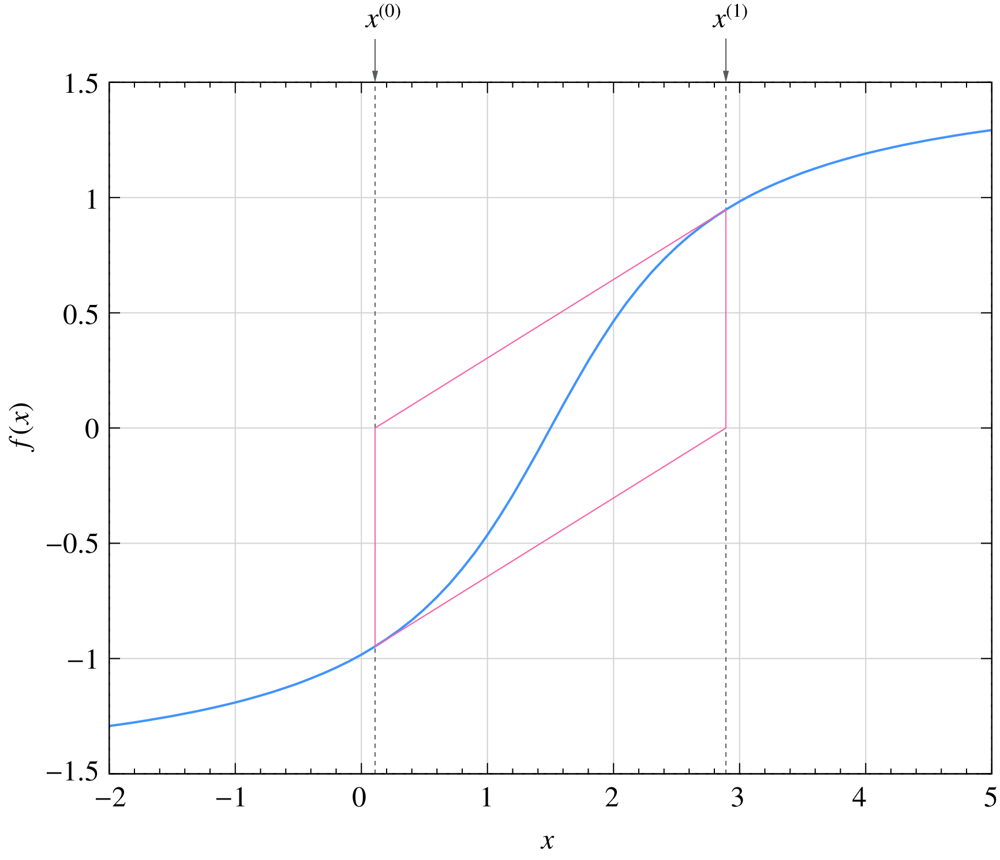

Failure of the NR procedure is not a hypothetical calamity; it is a
very real possibility in circuit simulation. Fortunately, some clever
ways have been devised to nudge the NR process toward convergence as
discussed in the following.

.. _nr_damping_1:

Damping of the NR iterations
============================

Consider the one variable case. As we have seen earlier, the NR method
is related to the Taylor series of the function around the current value
:math:`x^{(i)}`:

.. math::
   :label: eq_nr_15

   f(x^{(i)} + \Delta x^{(i)}) =
   f(x^{(i)})
   + \Delta x^{(i)}\,\left.\displaystyle\frac{df}{dx}\right|_{x^{(i)}}
   + {\textrm{higher-order~terms}}.

If the higher-order terms are small, the NR method is expected to work
well. Convergence problems can arise when they are not small. To be specific,
let us look at this
:ref:`nr_atan_3`
in which the NR process diverges.
The slope at
:math:`(x^{(i)},f(x^{(i)}))`
corresponds to the first term of the Taylor series, and the curvature
is due to the higher-order terms. We note that the slope does take us
in the correct *direction* (i.e., toward the root), but because of the
curvature, we may end up going too far in that direction. The idea behind
damping of the NR process is to play it safe and go only part of the way.

In the standard NR process, the correction vector is computed as
:math:`\Delta x^{(i)} = -\left[{\bf{J}}^{(i)}\right]^{-1}{\bf{f}}^{(i)}` and is
added to the current solution vector to obtain the next guess:

.. math::
   :label: eq_nr_16

   {\bf{x}}^{(i+1)} =
   {\bf{x}}^{(i)} +
   \Delta {\bf{x}}^{(i)}.

We can *dampen* or slow down the NR process by adding only a fraction of
the correction vector, i.e.,

.. math::
   :label: eq_nr_17

   {\bf{x}}^{(i+1)} =
   {\bf{x}}^{(i)} +
   k\, \Delta {\bf{x}}^{(i)},~~(0 < k < 1),

where :math:`k` is the **damping factor**.

The following figure shows the effect of damping for the :ref:`nr_atan_3`
with the same initial guess, viz.,
:math:`x^{(0)} = 0`. In each iteration, we draw a tangent at
:math:`(x^{(i)},f(x^{(i)}))` as before, but instead of going all the way to
the intercept with the :math:`x`-axis (the dashed line),  we go only a fraction
of the way to obtain the next iterate
:math:`x^{(i+1)}`. The NR process is now seen to converge to the solution.

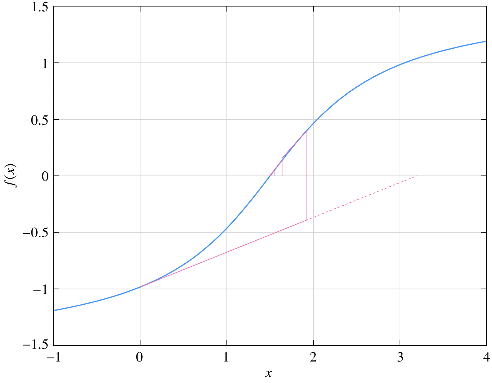

If damping it so effective, should we always use it? Not really. Although
damping improves the chances of convergence, it slows down the NR process.
Damping should therefore be used only if the standard NR process fails
to converge. The following figure shows the effect of :math:`k` for
:math:`f(x) = \tan ^{-1}(x)` with :math:`x^{(0)} = 1.5`. In this case, the
standard NR method fails, and therefore damping is useful. When :math:`k` is small,
the convergence is slower. An efficient strategy is to use damping only in the
first few NR iterations and then use the standard NR process (i.e., make
:math:`k = 1`) thereafter. In this way, we get convergence and also retain
the quadratic convergence property of the NR process when damping is lifted.
An example is shown in the same figure.

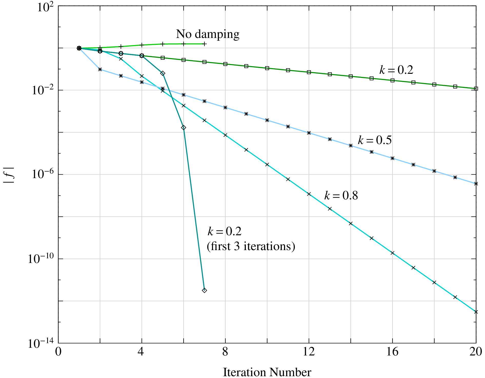

.. _nr_damping_2:

Parameter stepping
==================

Suppose we try to solve :math:`f(x) = 0` with an initial guess
:math:`x^{(0)}`,
and find that the standard NR method fails to converge. We can
then construct another function
:math:`h(x) = f(x)+g(x)`, where :math:`g(x)` is a suitable "auxiliary"
function. To be specific, let us consider
:math:`g(x) = kx`. To begin with, :math:`k` is made sufficiently large
(call it :math:`k^{(0)}`), :math:`h(x)` then takes an approximately linear form
:math:`h^{(0)}(x) \approx k^{(0)}x`, and the NR method can be used
effectively to solve
:math:`h^{(0)}(x) = 0` without any convergence issue. Let us denote
the solution obtained for
:math:`h^{(0)}(x) = 0` by :math:`r^{(0)}`. Next, we relax the parameter :math:`k`
in :math:`g(x)` to a smaller value :math:`k^{(1)}` and solve
:math:`h^{(1)}(x) \equiv f(x)+k^{(1)}x = 0`, using
:math:`r^{(0)}` as the initial guess. Once again, the NR process is likely
to converge if
:math:`k^{(1)}` is sufficiently close to
:math:`k^{(0)}`. We repeat this process, making :math:`k` progressively smaller.
Finally, when :math:`k` is negligibly small,
:math:`h(x) = f(x)+g(x) \approx f(x)`, and we have got the
solution for our original problem, :math:`f(x) = 0`.

The above procedure in which
the parameter :math:`k` is changed from a large value to zero
(or a negligibly small value)
in several steps may be called "parameter stepping."
The following figure shows the effect of parameter stepping
when solving
:math:`f(x) \equiv \tan ^{-1}(x-a) = 0` with
:math:`a = 1.5`, and
:math:`x^{(0)} = 0` as the initial guess. An auxiliary
function :math:`g^{(i)}(x) = k^{(i)}\,x` is used, and
:math:`h^{(i)}(x) = f(x) + g^{(i)}(x)` is solved with the
NR method. :math:`x = 0` is used as the initial guess
for solving :math:`h^{(0)} = 0`. Thereafter,
the solution :math:`r^{(i-1)}` for
:math:`h^{(i-1)} = 0` is used as the initial guess for solving
:math:`h^{(i)} = 0`. The values of :math:`k^{(i)}` for :math:`i = 0` to 5
are 5, 2, 1, 0.5, 0.2, 0, respectively. The roots are denoted by crosses.

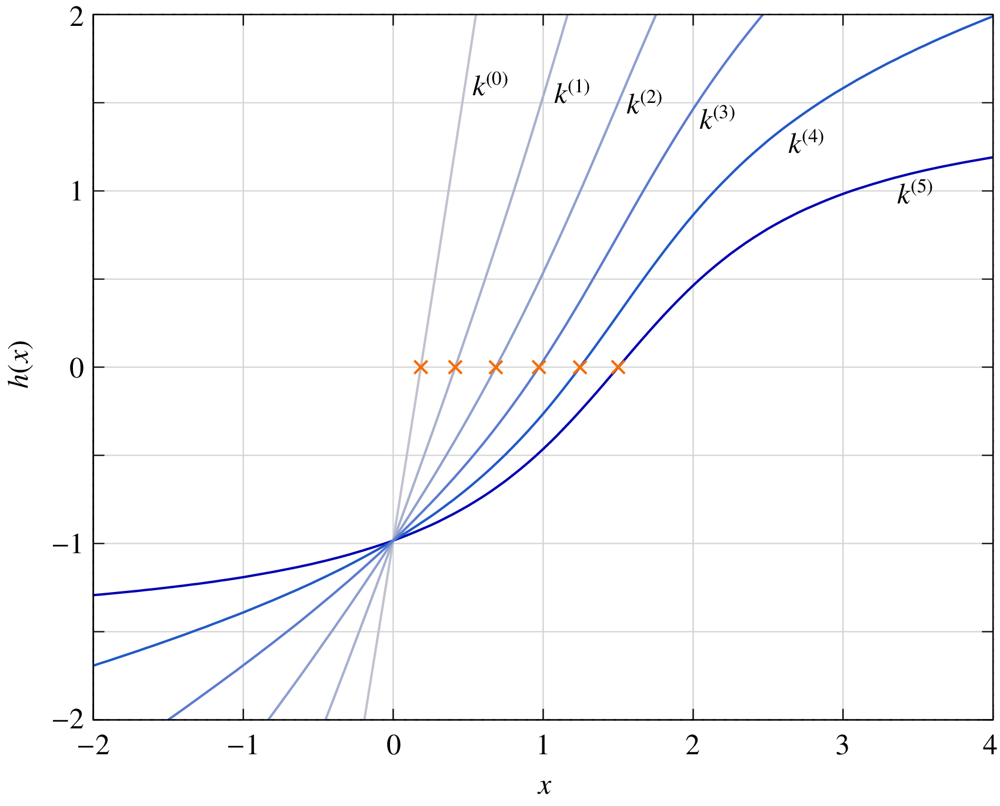

In electronic circuits, there are many situations in which
no suitable initial guess is available. Parameter stepping
is useful in such cases. It can be carried out in different
forms.

- :math:`g_{\mathrm{min}}` **stepping**:
  In this scheme, a conductance :math:`g` (i.e., a resistance :math:`1/g`) is added
  from each circuit node to ground, as shown in the following figure.
  If :math:`g` is large (i.e., the resistance is small),
  the nonlinear devices are essentially bypassed, the circuit reduces
  to an approximately linear circuit, and the NR method converges
  easily. Using the solution so obtained as the initial guess, the same
  circuit with a lower value of :math:`g` is then solved, and so on. Finally,
  when :math:`g` is equal to
  :math:`g_{\mathrm{min}}`
  (a very small value such as :math:`10^{-12}\,\mho`, i.e., a resistance of
  :math:`10^{12}\,\Omega`), we get the solution for the original circuit since
  the added resistances are as good as open circuits.

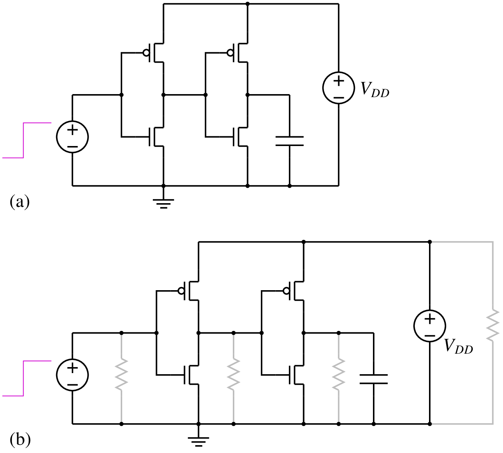

- **Source stepping**:
  In electronic circuits, there is a voltage supply (denoted typically
  by :math:`V_{CC}` in BJT circuits and by :math:`V_{DD}` in FET circuits) which
  "drives" the circuit. If this source voltage is made zero, all currents
  and voltages would become zero. This
  suggests that, with :math:`V_{CC}` (or :math:`V_{DD}`) equal to zero, the NR method
  should have no trouble in converging to the solution with the
  simple initial guess of zero currents and voltages. Next, we increase
  :math:`V_{CC}` by a small amount, say, :math:`0.1\,{\textrm{V}}`.
  Since this situation is not substantially different, we once again expect the
  NR process to converge
  easily. Continuing this procedure, we finally obtain the solution for the
  actual source voltage, typically :math:`5\,{\textrm{V}}` in BJT circuits.
  Since the parameter being stepped is a source voltage, we can refer to this
  procedure as "source stepping."

  A variation of the above approach is "source ramping" in which the source
  voltage is ramped (in time) from :math:`0\,{\textrm{V}}` to its final
  value in a suitable time interval, taking the solution obtained at a given
  time point as the initial guess for the next time point.

.. _diode_limiting:

Limiting junction voltages
==========================

Semiconductor devices generally have one or more :math:`p`-:math:`n` junctions.
In the actual solution for the circuit under consideration, the voltage
across a junction is limited to about :math:`0.8\,{\textrm{V}}` which corresponds to a
few Amps.
However, during the NR process, some of the junction voltages
can become larger than the values expected in the solution,
causing the current~-- which is proportional to
:math:`e^{V/V_T}` -- to blow up. For example, with :math:`V = 2\,{\textrm{V}}` and
:math:`V_T = 26\,{\textrm{mV}}`,
:math:`e^{V/V_T}` is of the order of :math:`10^{33}`. When that happens, the NR method
comes to a grinding halt because of numerical overflow. It is important
therefore to limit the junction voltages in the NR process. The strategy
used in SPICE for this purpose is shown in the flow chart below.
The junction voltages in iterations :math:`i` and :math:`(i+1)` are denoted by
:math:`V_{\mathrm{old}}` and
:math:`V_{\mathrm{new}}`, respectively. The "critical voltage"
:math:`V_{\mathrm{crit}}` in the flow chart is a fixed voltage at which
the exponential factor
:math:`e^{V/V_T}` becomes impractically large.

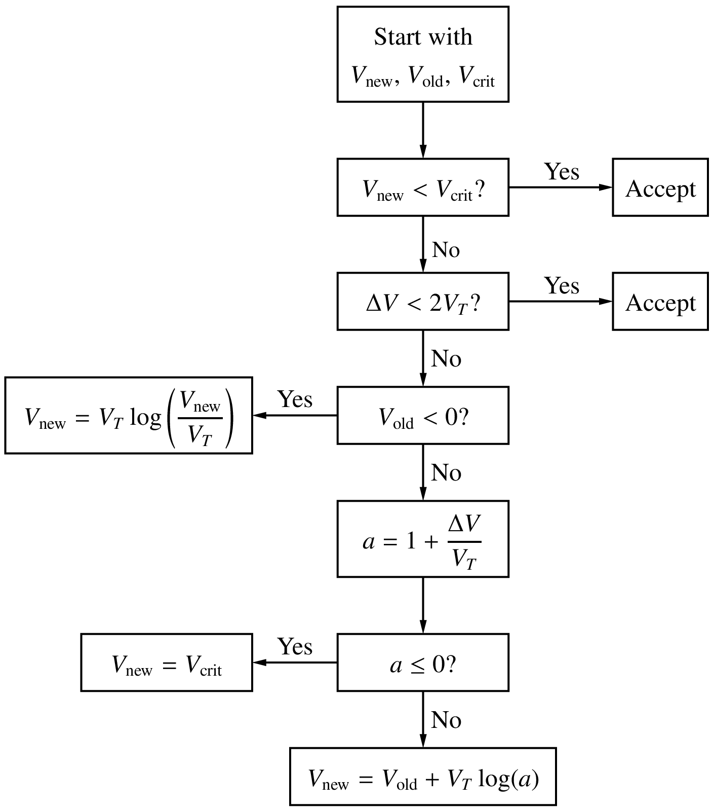

.. _change_delt:

Changing time step
==================

In transient (or "dynamic") simulation, the time axis is discretised,
and the circuit equations are solved at
discrete time points
:math:`t_0`,
:math:`t_1`,
:math:`t_2`,
:math:`\cdots`,
:math:`t_n`,
:math:`t_{n+1}`,
all the way up to the last time point of interest
:math:`t_{\mathrm{end}}` (see figure). The solution at :math:`t_n`
serves as the initial guess for the NR process at :math:`t_{n+1}`.
If :math:`t_{n+1}` is sufficiently close to :math:`t_n`,
we expect the NR process at :math:`t_{n+1}` to converge easily.
If we perform a fixed number of NR iterations and find that
the NR process has not converged, we can reduce the time step
:math:`\Delta t = t_{n+1}-t_n`, i.e., bring
:math:`t_{n+1}` closer to
:math:`t_n`. In other words, we now look for
:math:`{\bf{x}}_{n+1}` which is closer to
:math:`{\bf{x}}_n`, and that improves the chances of convergence.

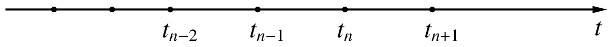

.. _nr_circuits:

==================
Nonlinear circuits
==================

In combination with the
:ref:`Modified Nodal Analysis <mna>` (MNA) approach
for assembling the circuit equations,
the NR method can be used to obtain the solution -- currents and
voltages -- for a nonlinear circuit. Consider the circuit shown below.

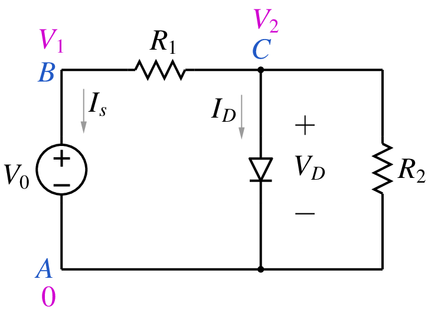

The diode current can be written using the Shockley equation as

.. math::
   :label: eq_nr_18

   I_D = I_s\left(e^{V_D/V_T}-1\right) =
   I_s\left(e^{V_2/V_T}-1\right) \equiv I_D(V_2),

where :math:`I_s` is the reverse saturation current of the diode (typically
of the order of pA for low-power diodes), and
:math:`V_T = kT/q` is the thermal voltage (about :math:`25\,{\textrm{mV}}` at room
temperature). Using the MNA approach,
we can assemble the circuit equations as

  .. math::
     :label: eq_nr_19

     \begin{align}
     {\textrm{KCL at B}}:~~ &
     G_1(V_1-V_2) + I_s &= 0
     \,, \\
     {\textrm{KCL at C}}:~~ &
     G_1(V_2-V_1) +G_2V_2 + I_D(V_2) &= 0
     \,, \\
     {\textrm{Voltage source equation}}:~~ &
     V_1-V_0 &= 0
     \,.
     \end{align}

The above set of equations can be solved with the NR method, starting with
a suitable initial guess for the three variables, viz.,
:math:`V_1`,
:math:`V_2`, and
:math:`I_s`.

In a similar manner, the NR scheme can be used for transient
simulation. More about that later, after we cover numerical
solution of ODEs.
