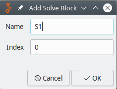
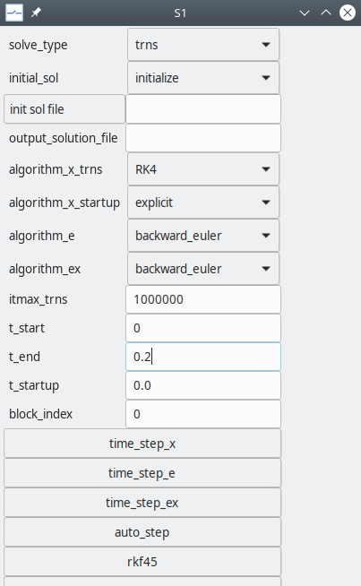

============
Solve Blocks
============

After a circuit schematic is prepared, we need to
convey to the simulator what kind of simulation needs
to be performed, which method to use, which output
parameters should be saved, etc. This task is performed
by a solve block.

Many of the solve block statements are related to the
numerical methods employed by GSEIM.
Some basic familiarity with the following topics
would therefore help in understanding the solve
block statements.

- :ref:`modified nodal analysis <mna>`
- :ref:`Newton-Raphson method <nr>`
- :ref:`methods for solving ODEs <numerical>`
- :ref:`steady-state waveform computation <ssw>`
- :ref:`start-up simulation <startup>`

Solve blocks are of two types:

- ``startup`` solve block for start-up simulation
- ``trns`` solve block for transient simulation

Multiple solve blocks per project are allowed. Here are
a few situations where multiple solve block would be useful:

- We want to perform a start-up simulation and use the
  solution as a starting point for transient simulation.

- We have performed transient simulation from
  :math:`t = 0` to
  :math:`t = t_1`.
  We want to continue from
  :math:`t_1`
  and perform transient simulation up to
  :math:`t_2`,
  without having to repeat the
  :math:`0 < t < t_1`
  part.

In most cases, we are interested in a single transient simulation,
and therefore only one solve block is required.

A new solve block can be added by clicking on
``SolveBlocks``
:math:`\rightarrow`
``Add Solve Block``.

A dialog box for a new solve block appears as shown below.

The solve block needs to be assigned a suitable name, e.g, ``S1``.
The ``index`` field determines the order in which solve blocks are
executed. For example, if there are two solve blocks with names
``S1``, ``S2`` and indices 0, 1, respectively, the solve block
``S1`` will be executed first, followed by ``S2``.

When a solve block is added, it gets a set of default parameter values
from the file ``~/gseim_grc/gseim/exec/gseim_slvparms.in``.
These values can be edited by clicking on
``SolveBlocks``
:math:`\rightarrow`
``Edit Solve Block``.

A dialog box with parameters appears as shown below.

We will now describe the solve block parameters.
In the interest of brevity, we will use the following definitions.

+----------------+------------------------------+
|   Name         |  meaning                     |
+================+==============================+
| ``x circuit``  |  circuit has only xbe's      |
+----------------+------------------------------+
| ``e circuit``  |  circuit has only ebe's      |
+----------------+------------------------------+
| ``ex circuit`` |  circuit has ebe's and xbe's |
+----------------+------------------------------+

The following points may be noted.

- Parameters names starting with ``x_`` (or ending with ``_x``)
  generally apply to ``x`` circuits.
- Parameters names starting with ``e_`` (or ending with ``_e``)
  generally apply to ``e`` circuits.
- Parameters names starting with ``ex_`` (or ending with ``_ex``)
  generally apply to ``ex`` circuits.
- Parameters with ``_nr_`` in their names are related to the Newton-Raphson
  method.

Solve Block Statements
======================

- ``solve_type``:

  - *trns* for transient simulation
  - *startup* for start-up simulation
  - *ssw* for steady-state waveform simulation

- ``initial_sol`` is related to the initial solution, i.e., the starting
  point for transient simulation. There are three options.

  - *initialize* for initializing variables before transient simulation
  - *previous* for continuing with the solution obtained in the previous
    solve block as the initial solution
  - *read_from_file* for reading the initial solution from a file

- ``init sol file``: This field is relevant
  if ``initial_sol`` is *read_from_file*. It is assumed that the solution
  file already exists, and the user can click on the
  ``init sol file`` button and select it from the file menu.
- ``output_solution_file``: name of the solution file; it needs to be
  supplied if the user wants to save the solution file (at the end of
  the simulation). The complete file path may be specified; if only the
  file name is specified, the file would get created in
  ``~/gseim_grc/gseim/output/``.
- ``algorithm_x_trns``: transient simulation algorithm; it applies
  to ``x`` circuits.
- ``algorithm_x_startup``: start-up simulation algorithm; it applies
  to ``x`` circuits.
- ``algorithm_e``: transient simulation algorithm; it applies to
  ``e`` circuits.
- ``algorithm_ex``: transient simulation algorithm; it applies
  to ``ex`` circuits.
- ``itmax_trns``: maximum number of time points allowed in transient simulation.
  This is a *safety feature* to prevent the user from mistakenly
  generating large output files that could fill up the disk.
- ``t_start``: starting time for transient simulation
- ``t_end``: ending time for transient simulation
- ``t_startup``: time at which start-up simulation is to be performed (ignored
  for transient simulation)
- ``block_index``: index of the solve block being edited. If there are multiple
  solve blocks, the one with the lowest ``block_index`` is executed first, and so on.
  (Not relevant if there is only one solve block)
- ``time_step_x``: Parameters in this group apply to ``x`` circuits.

  - ``tstep0_x``: time step. For constant time-step methods, this parameter specifies
    the uniform time step. For auto time-step methods, it specifies the initial
    time step.
  - ``delt_min_x``: smallest time step allowed during transient simulation
  - ``delt_max_x``: largest time step allowed during transient simulation

- ``time_step_e``: Parameters in this group apply to ``e`` circuits.

  - ``tstep0_e``: time step. For constant time-step methods, this parameter specifies
    the uniform time step. For auto time-step methods, it specifies the initial
    time step.
  - ``delt_min_e``: smallest time step allowed during transient simulation
  - ``delt_max_e``: largest time step allowed during transient simulation

- ``time_step_ex``: Parameters in this group apply to ``ex`` circuits.

  - ``tstep0_ex``: time step. For constant time-step methods, this parameter specifies
    the uniform time step. For auto time-step methods, it specifies the initial
    time step.
  - ``delt_min_ex``: smallest time step allowed during transient simulation
  - ``delt_max_ex``: largest time step allowed during transient simulation

- ``auto_step``: Parameters in this group apply when the
  ``backward_euler_auto`` or
  ``trz_auto`` method is selected.

  - ``factor_step_increase``: factor by which time step is increased
    in successive iterations.
  - ``factor_step_decrease``: factor by which time step is decreased
    in successive iterations.
  - ``itmax_stepred``: maximum number of successive reductions in the time step at
    a given time point.

- ``rkf45``: Parameters in this group apply when the ``RKF45`` method is
  selected.

  - ``rkf45_tolr``: tolerance for the RKF45 method
  - ``rkf45_fctr_min``: lower limit on multiplier :math:`k` of RKF45 algorithm where
    :math:`\Delta t_{\mathrm{new}} = k \times \Delta t_{\mathrm{new}}`.
  - ``rkf45_fctr_max``: upper limit on multiplier :math:`k` of RKF45 algorithm

- ``bs23``: Parameters in this group apply when the ``BS23`` method is
  selected.

  - ``bs23_tolr``: tolerance for the BS23 method
  - ``bs23_fctr_min``: lower limit on multiplier :math:`k` of BS23 algorithm
  - ``bs23_fctr_max``: upper limit on multiplier :math:`k` of BS23 algorithm

- ``TRBDF2``: Parameters in this group apply when the ``TRBDF2`` method is
  selected.

  - ``trbdf2_tolr``: tolerance for the TR-BDF2 method
  - ``itmax_trbdf2``: maximum number of successive reductions in the time step at
    a given time point when TR-BDF2 algorithm is selected.

- ``write_to_console``: Parameters in this group are related to printing
  iteration number in transient simulation (i.e., time point number)
  and time to the console.

  - ``write_iter_n_x``: Interval in terms of number of iterations after which
    GSEIM should write the iteration number (time point number) to the console.
    Applies to ``x`` and ``ex`` circuits.
  - ``write_time_x``: This parameter should be set to *yes* if the time
    should also be printed to the console (along with the time point number).
    Applies to ``x`` and ``ex`` circuits.
  - ``write_iter_n_e``: Interval in terms of number of iterations after which
    GSEIM should write the iteration number (time point number) to the console.
    Applies to ``e`` and ``ex`` circuits.
  - ``write_time_e``: This parameter should be set to *yes* if the time
    should also be printed to the console (along with the time point number).
    Applies to ``e`` and ``ex`` circuits.

- ``x_nr``: Parameters in this group are related to NR convergence for ``x`` circuits.

  - ``x_nr_itermax``: maximum number of Newton-Raphson (NR) iterations
  - ``x_nr_dmp``: *yes* if damping should be used in NR iterations
  - ``x_nr_dmp_itermax``: number of NR iterations for which damping should be applied
  - ``x_nr_dmp_k``: damping factor for NR iterations
  - ``x_nr_itermax0``, ``x_nr_dmp0``, ``x_nr_dmp_itermax0``, ``x_nr_dmp_k0``: like
    the above NR parameters except that these apply to the first time point.
  - ``x_nr_check_delx_all``: *yes* if the :math:`\Delta x` norm should be used
    for convergence (see :ref:`delx norm <delx_norm>`)
  - ``x_nr_eps_delx_all``: tolerance value for the :math:`\Delta x` norm
  - ``x_nr_write_rhs2``: *yes* for writing the 2-norm to the console (used for debugging)

- ``e_nr``: Parameters in this group are related to NR convergence for ``e``
  and ``ex`` circuits.

  - ``e_nr_itermax``: maximum number of Newton-Raphson (NR) iterations
  - ``e_nr_dmp``: *yes* if damping should be used in NR iterations
  - ``e_nr_dmp_itermax``: number of NR iterations for which damping should be applied
  - ``e_nr_dmp_k``: damping factor for NR iterations
  - ``e_nr_itermax0``, ``e_nr_dmp0``, ``e_nr_dmp_itermax0``, ``e_nr_dmp_k0``: like
    the above NR parameters except that these apply to the first time point.
  - ``e_nr_check_spice``: *yes* if the SPICE norm should be used
    for convergence (see :ref:`SPICE norm <spice_norm>`)
  - ``e_nr_check_delx_all``: *yes* if the :math:`\Delta x` norm should be used
    for convergence (see :ref:`delx norm <delx_norm>`)
  - ``e_nr_write_rhs2``: *yes* for writing the 2-norm to the console (used for debugging)
  - ``e_nr_spice_vntol``, ``e_nr_spice_abstol``, ``e_nr_spice_reltol``: the SPICE norms
    ``VNTOL``, ``ABSTOL``, ``RELTOL``, respectively
    (see :ref:`SPICE norm <spice_norm>`)

- ``ex_nr``: Parameters in this group are related to NR convergence for ``ex`` circuits.

  - ``ex_nr_itermax``: maximum number of Newton-Raphson (NR) iterations
  - ``ex_nr_dmp``: *yes* if damping should be used in NR iterations
  - ``ex_nr_dmp_itermax``: number of NR iterations for which damping should be applied
  - ``ex_nr_dmp_k``: damping factor for NR iterations
  - ``ex_nr_itermax0``, ``ex_nr_dmp0``, ``ex_nr_dmp_itermax0``, ``ex_nr_dmp_k0``: like
    the above NR parameters except that these apply to the first time point.
  - ``ex_nr_check_delx_all``: *yes* if the :math:`\Delta x` norm should be used
    for convergence (see :ref:`delx norm <delx_norm>`)
  - ``ex_nr_eps_delx_all``: tolerance value for the :math:`\Delta x` norm
  - ``ex_nr_write_rhs2``: *yes* for writing the 2-norm to the console (used for debugging)

- ``SSW``: parameters in this group are related to steady-state waveform computation.

  - ``ssw_period``, ``ssw_frequency``: period and frequency, respectively. One of
    these should be specified.
  - ``ssw_period_mult``: number of SSW periods to be simulated.
    Only one period is really required to be simulated. However, the user may want
    to view a graph showing a few periods, and therefore this option is made
    available.
  - ``ssw_nr_eps_rhs``: 2-norm to check for convergence of the outer NR loop in
    the :ref:`SSW flow chart <ssw_flowchart>`
  - ``ssw_ndiv``: This parameter is used to compute the time step (given by the
    period divided by ``ssw_ndiv``). If the time step is already specified
    (using ``tstep0_x``, ``tstep0_e``, or ``tstep0_ex``), then ``ssw_ndiv`` is
    ignored.
  - ``ssw_nr_itermax``: Maximum number of outer NR iterations
    (see :ref:`SSW flow chart <ssw_flowchart>`)
  - ``ssw_nr_dmp``: *yes* if damping is to be used for the outer NR iterations
  - ``ssw_nr_dmp_k``: damping factor :math:`k` (:math:`0 < k < 1`) for the outer NR loop
    (see :ref:`damping <nr_damping_1>`).
    Relevant only if ``ssw_nr_dmp`` is set to *yes*.
  - ``ssw_nr_dmp_itermax``: number of outer NR iterations for which damping should
    be applied.

