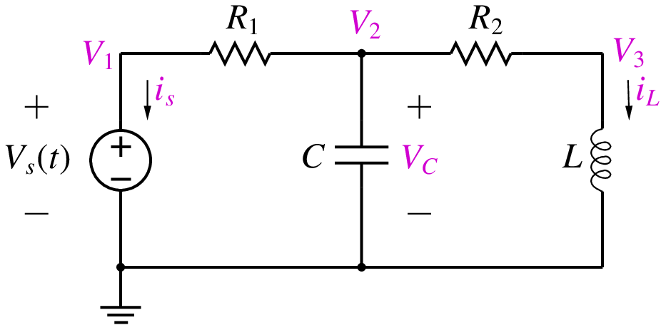
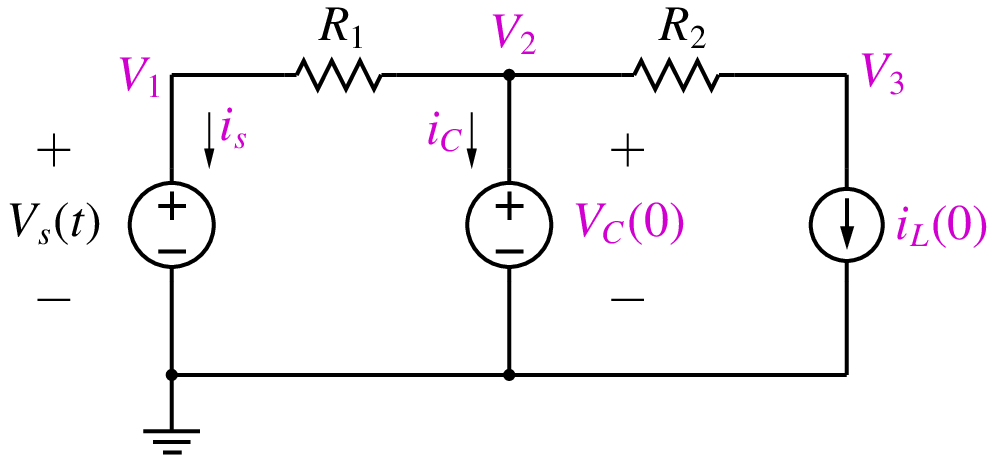
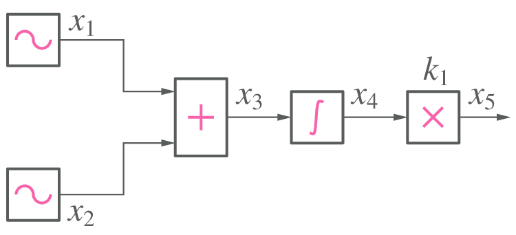
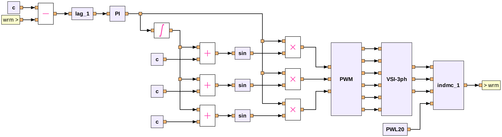
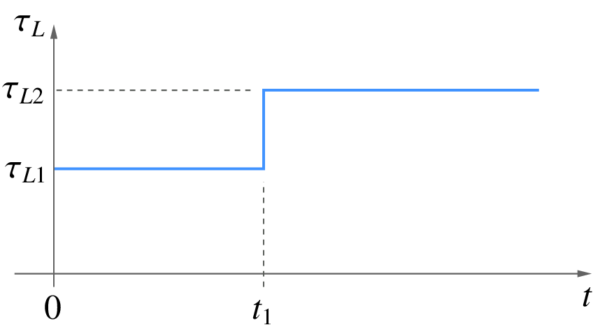

.. _startup:

###################
Start-up simulation
###################

When we perform transient simulation of a circuit (system),
we need to assign suitable values to all variables involved
in the problem. There are three options.

- Assign zero to all variables (all voltages, currents,
  and any other variables).
- Use a previously saved solution as the starting point.
- Use the **start-up** solution as the starting point.

The first option is frequently used although it is somewhat
artificial (since it does not correspond to
a valid solution for the circuit being simulated). The second
option corresponds to a valid solution since it has been obtained
by simulating the same circuit previously. It is the third option
we want to discuss in this section, viz., the start-up solution.

Let us illustrate the idea of a start-up solution with an example,
the circuit shown below.

Suppose we
are interested in performing transient simulation of the circuit
from :math:`t = 0` to some known final time :math:`t_{\mathrm{end}}`.
Suppose the initial values of the
state variables,
:math:`V_C(0)` and
:math:`i_L(0)`, are known.
Corresponding to these initial values, there is a "start-up" solution
(consisting of the node voltages and currents) which satisfies the
circuit equations. It is this start-up solution that we want to obtain
first, and then use it as a starting point for transient simulation.

With the conditions,
:math:`V_C = V_C(0)` and
:math:`i_L = i_L(0)`, the circuit can be replaced by that shown below.

Since the voltage across the capacitor
is known, we replace it with a DC voltage source. Similarly,
since the current through the inductor is known, we replace it with
a DC current source. We can now use the MNA approach to assemble the
circuit equations as

.. math::
   :label: eq_strt_1

   G_1(V_1-V_2) + i_s = 0,

.. math::
   :label: eq_strt_2

   G_1(V_2-V_1) + G_2(V_2-V_3) + i_C = 0,

.. math::
   :label: eq_strt_3

   G_2(V_3-V_2) = -i_L(0),

.. math::
   :label: eq_strt_4

   V_1 = V_s(0),

.. math::
   :label: eq_strt_5

   V_2 = V_C(0),

where
:math:`G_1 = 1/R_1`,
:math:`G_2 = 1/R_2`. We have introduced the capacitor
current as an additional system variable as required by the MNA
formulation (since the capacitor has been replaced with a voltage source).
By solving the above equations, we obtain the start-up solution.
Note that the start-up solution is different from the DC solution which is obtained
by replacing capacitors with open circuits and inductors with short circuits.

If there are nonlinear elements in the circuit, the procedure remains the
same except that the equations would need to be solved iteratively,
using the Newton-Raphson method, for example.

The start-up situation also arises in flow graphs (i.e., systems without
electrical elements). As an example, consider the flow graph shown below.

In this case, the integrator involves a time derivative and contributes
a state variable. In transient simulation, we would use a discretised
version of the integrator equation (as seen in the :ref:`numerical`), viz.,
:math:`x_4 = \displaystyle\int x_3\,dt` or
:math:`\displaystyle\frac{dx_4}{dt} = x_3`.
In start-up simulation, we replace it by
:math:`x_4 = x_4(t_0)`, where :math:`x_4(t_0)` is known (specified by
the user). The complete set of equations to be solved can then be written
as (at :math:`t = t_0`),

.. math::
   :label: eq_strt_6

   \begin{align}
   x_1 = A_1 \sin \omega t_0\,\\
   x_2 = A_2 \sin \omega t_0\,\\
   x_3 = x_1 + x_2\,\\
   x_4 = x_4(t_0)\,\\
   x_5 = k_1\,x_4\,.
   \end{align}

In real life, most of the circuits (systems) we want to simulate are far
more complex than the above examples, and we have no way of specifying
the start-up values for the state variables. Consider, for example,
the PI control flow graph shown below, with a step change applied in the
load torque from
:math:`\tau_{L1}` to
:math:`\tau_{L2}`.

For start-up simulation of this system (corresponding to the
initial value :math:`\tau_{L1}` of the load torue), we will need
to specify the values of the state variables of the induction motor
(:math:`\psi_{ds}`,
:math:`\psi_{qs}`,
:math:`\psi_{dr}`,
:math:`\psi_{qr}`,
:math:`\omega _{rm}`), and it is difficult -- if at all possible --
to obtain these analytically. In this case, we would start with the
zero initial solution, perform transient simulation with
:math:`\tau _L = \tau _{L1}`
from 0 to :math:`t_1`, and then apply the step change, as shown in
the following figure.
We need to ensure that :math:`t_1` is sufficiently large so that
the system reaches its steady state at :math:`t = t_1`.

